# Jenkins部署（ubuntu20.04）
环境需求：由于我是使用的Docker来进行Jenkins的部署所以一些环境需要预装在实体机器通过挂载的方式放Jenkins去使用

## 预装环境

### Java 11

```shell
#安装java jdk
sudo apt-get install openjdk-11-jdk
```

### Maven3.8

```shell
#进入Maven官网
# 1.https://maven.apache.org/download.cgi
# 2.下载 apache-maven-3.8.8-bin.tar.gz 其他版本也可以 这边使用的是3.8
# 3.将文件上传到服务器任意路径中 我存放的位置是(/mydata/jenkins/maven) 没有这个路径创建即可
# 4.将文件夹解压 
tar -xzvf apache-maven-3.8.8-bin.tar.gz
# 解压后生成apache-maven-3.8.8目录 配置该目录到 /etc/profile下
vi /etc/profile
export MAVEN_HOME=/mydata/jenkins/maven/apache-maven-3.8.8
export CLASSPATH=${MAVEN_HOME}/lib:$CLASSPATH
export PATH=${MAVEN_HOME}/bin:$PATH
# 刷新环境变量
source /etc/profile
# 查看mvn环境是否配置成功
mvn -v
# 看见如下提示成功配置好Maven环境
Apache Maven 3.8.8 (4c87b05d9aedce574290d1acc98575ed5eb6cd39)
Maven home: /mydata/jenkins/maven/apache-maven-3.8.8
Java version: 11.0.20.1, vendor: Ubuntu, runtime: /usr/lib/jvm/java-11-openjdk-amd64
Default locale: zh_CN, platform encoding: UTF-8
OS name: "linux", version: "6.2.0-32-generic", arch: "amd64", family: "unix"

# 安装好后修改Maven镜像源 和修改保存路径
cd /mydata/jenkins/maven/apache-maven-3.8.8/conf
vi settings.xml
```

配置如下

```xml
<?xml version="1.0" encoding="UTF-8"?>
<settings xmlns="http://maven.apache.org/SETTINGS/1.2.0"
          xmlns:xsi="http://www.w3.org/2001/XMLSchema-instance"
          xsi:schemaLocation="http://maven.apache.org/SETTINGS/1.2.0 https://maven.apache.org/xsd/settings-1.2.0.xsd">
    <!-- 本地存放地址 -->
  <localRepository>/mydata/jenkins/maven/mavenrepo</localRepository>
  
  <pluginGroups>
  </pluginGroups>
  
  <proxies>
  </proxies>
  
  <servers>
  </servers>
  
  <mirrors>
      <!-- 镜像源 -->
    <mirror>
      <id>aliyunmaven</id>
      <mirrorOf>*</mirrorOf>
      <name>阿里云公共仓库</name>
      <url>https://maven.aliyun.com/repository/public</url>
    </mirror>
  </mirrors>
  
  <profiles>
  </profiles>
  
</settings>
```

### Docker

```shell
# 卸载旧版本docker (如果有旧版本的docker 没有可以跳过)
sudo apt-get remove docker docker-engine docker.io containerd runc
# 1.更新及安装工具软件
sudo apt-get update
# 2.安装几个工具软件
sudo apt-get install \
    apt-transport-https \
    ca-certificates \
    curl \
    gnupg \
    lsb-release
# 3.增加一个docker的官方GPG key： gpgkey：是用来验证软件的真伪 ——防伪的
curl -fsSL https://download.docker.com/linux/ubuntu/gpg | sudo gpg --dearmor -o /usr/share/keyrings/docker-archive-keyring.gpg
# 4.下载仓库文件
echo \
  "deb [arch=amd64 signed-by=/usr/share/keyrings/docker-archive-keyring.gpg] https://download.docker.com/linux/ubuntu \
  $(lsb_release -cs) stable" | sudo tee /etc/apt/sources.list.d/docker.list > /dev/null
# 安装docker
# 1、再次更新系统
sudo apt-get update
# 2、安装docker-ce软件
sudo apt-get install docker-ce docker-ce-cli containerd.io -y
# 查看docker是否安装成功
ps aux|grep docker
```

## Docker启动Jenkins

```shell
# 因为我需要将文件保存所以会将路径挂载出来

# 先创建/mydata/jenkins/jenkins_home 文件夹
mkdir -p /mydata/jenkins/jenkins_home

# 为了在容器中使用docker 还需要修改docker.sock的所有者
cd /var/run/docker.sock
chown root:root docker.sock

# docker启动 
docker run -d --name myjenkins -u root -p 18080:8080 -p 50000:50000 --restart=on-failure -v /mydata/jenkins/jenkins_home:/var/jenkins_home -v /mydata/jenkins/maven/apache-maven-3.8.8:/usr/local/maven/apache-maven-3.8.8 -v /var/run/docker.sock:/var/run/docker.sock -v /usr/bin/docker:/usr/bin/docker -v /etc/docker/daemon.json:/etc/docker/daemon.json  jenkins/jenkins:lts-jdk11 
```

-d 指定后台运行docker

--name 指定容器名字

-u 指定容器权限 以root用户

-p 指定暴露端口 18080:8080 (本地映射端口:容器内程序端口) 我这里是8080被占用换成了18080

--restart=on-failure 失败自动重启

-v /mydata/jenkins/jenkins_home:/var/jenkins_home  挂载jenkins_home 到本机的目录

-v /mydata/jenkins/maven/apache-maven-3.8.8:/usr/local/maven/apache-maven-3.8.8 挂载Maven给Jenkins使用

-v /var/run/docker.sock:/var/run/docker.sock 

-v /usr/bin/docker:/usr/bin/docker				挂载docker给jenkins使用

 -v /etc/docker/daemon.json:/etc/docker/daemon.json	挂载本地的镜像源给docker加速使用

 jenkins/jenkins:lts-jdk11 使用这个版本的jenkins

```shell
# 正常启动后查看 看见myjenkins status up正常启动
docker ps -a 
```

### 安装node环境

如果需要Jenkins打包前端项目需要安装node 这边使用nvm来进行node版本管理

```shell
# 进入jenkins容器
docker exec -it myjenkins /bin/bash
# 下载nvm安装的脚本
curl -o- https://raw.githubusercontent.com/nvm-sh/nvm/v0.39.3/install.sh | bash
# 刷新环境变量
source ~/.$(basename $SHELL)rc
# 查看nvm是否成功
nvm  -v
# 安装node (这边使用18.12.0)
nvm install 18.12.0 
# 查看node是否安装成功
node -v
```

然后再jenkins中把环境变量添加，添加需要的环境让jenkins可以找到

键

PATH

值

/root/.nvm/versions/node/v18.12.0/bin:/opt/java/openjdk/bin:/usr/local/sbin:/usr/local/bin:/usr/sbin:/usr/bin:/sbin:/bin

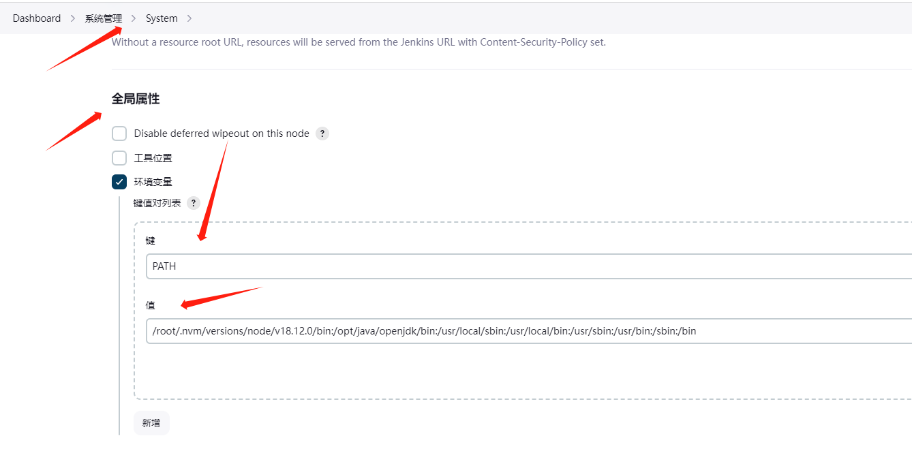

## Jenkins编译运行Maven项目

先安装[Maven Integration plugin](https://plugins.jenkins.io/maven-plugin)插件

在系统属性下的插件管理

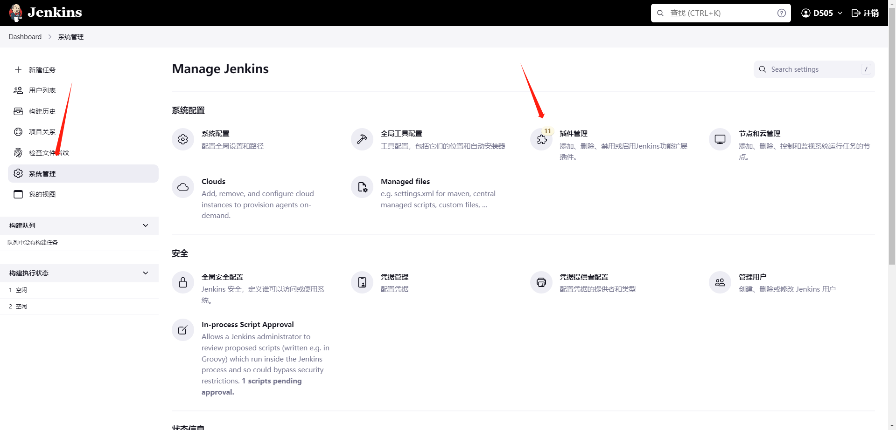

在可用插件中搜索安装

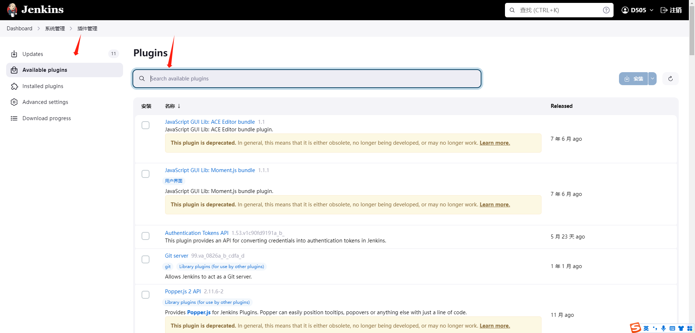

插件安装好后可以配置Maven地址 

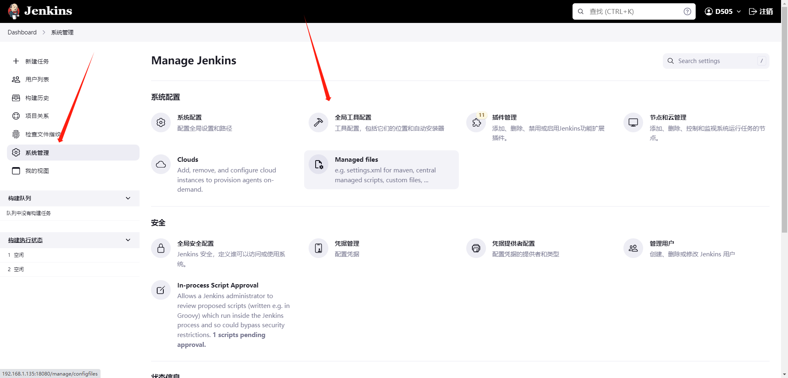

在Maven安装增添加Maven的路径 /usr/local/maven/apache-maven-3.8.8

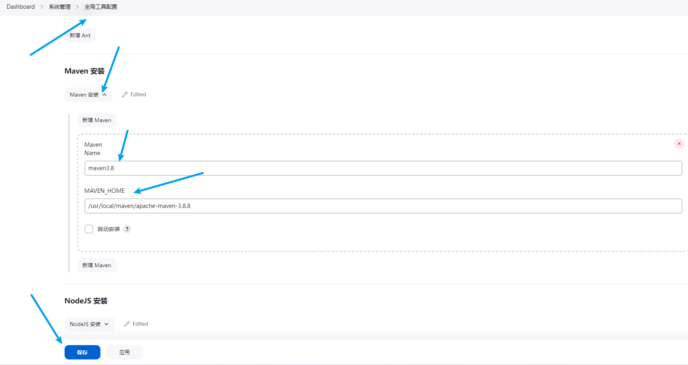

安装好后可以新建任务 选择构建Maven项目

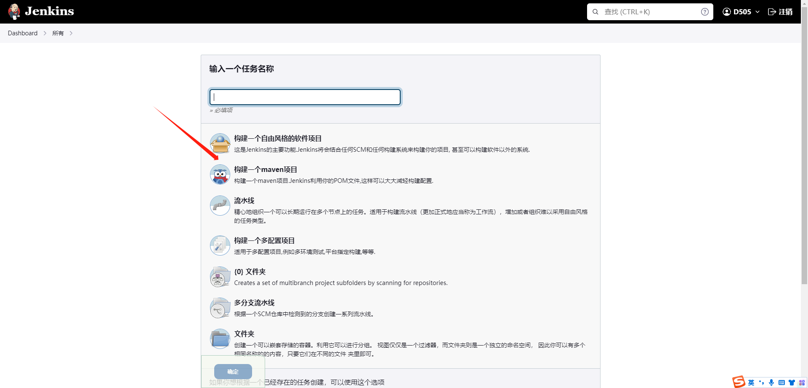

填写好项目地址

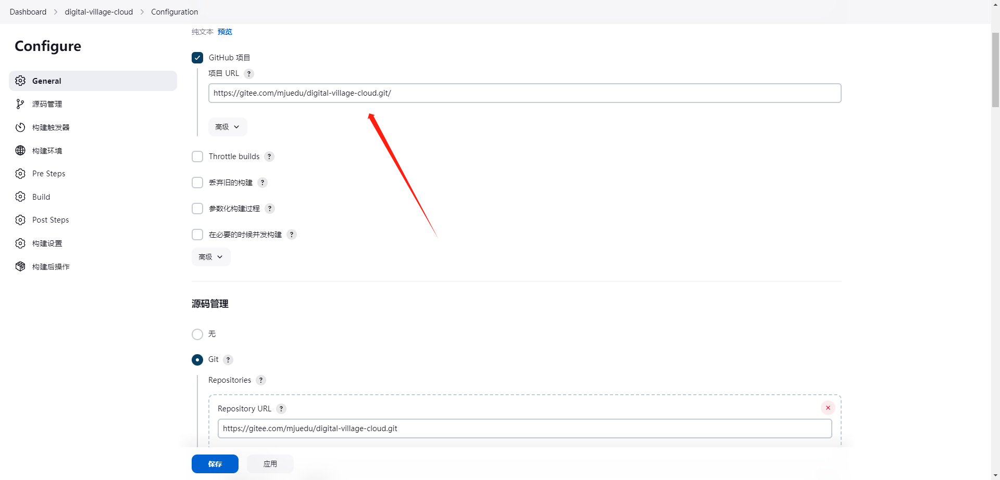

填写好项目地址，如果是私有仓库需要添加账号，设置好分支这边以master为例

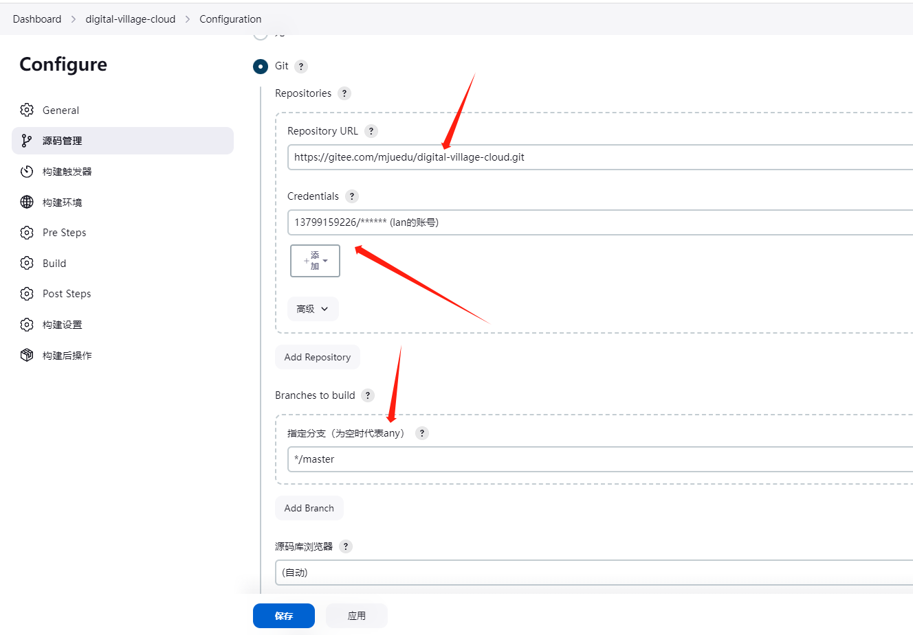

选择全局凭证 使用账号和密码 填写好用户名和密码(如果需要权限拉去的 公开仓库可以跳过这步)

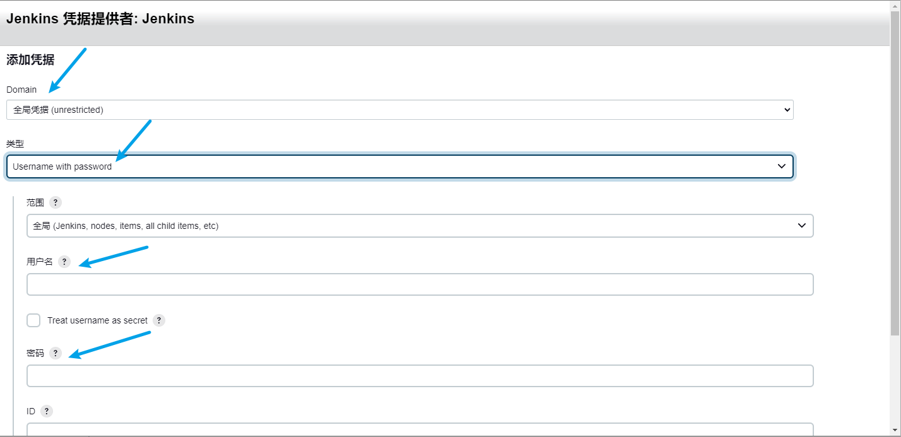

填写好pom文件的路径 根路径是你的项目 并设置跳过测试clean install package '-Dmaven.test.skip=true'

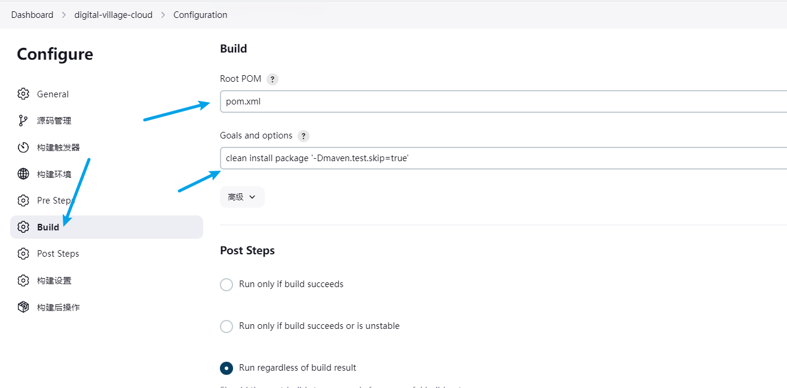

配置好后即可完成项目构建 可以点击立即构建测试一下是否能够正常打包项目

## JenKins编译运行Vue项目

新建项目 选择自由风格项目

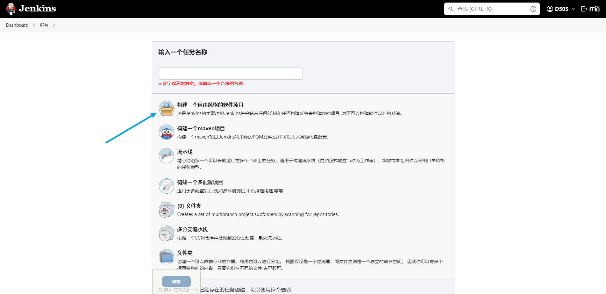

设置git项目地址 并配置构建保存天数和最大个数

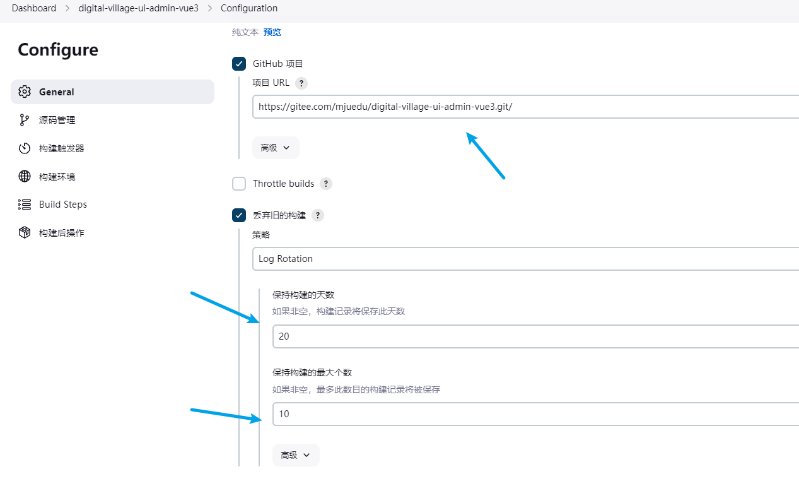

同样的配置git账号选择分支

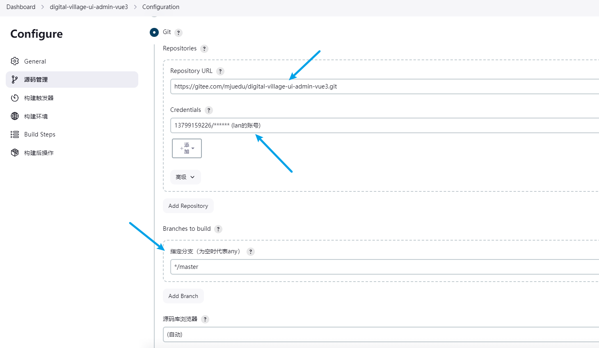

增加Build Steps 编写构建shell脚本

```shell
# 查看版本信息
npm -v
# 将镜像源替换为淘宝的加速访问
npm config set registry https://registry.npm.taobao.org
# 安装项目依赖
pnpm install
# 项目打包
npm run build:dev
```

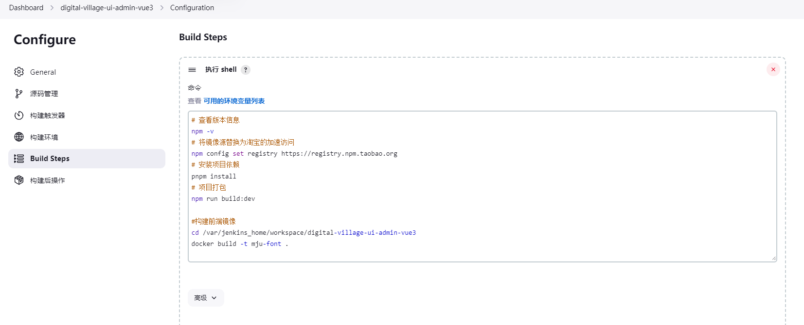

## 构建Docker镜像

(可选 对需要打包到docker自动运行)

在能成功构建够添加需要执行的shell

```shell
# 举例 构建gateway镜像 (这是在jenkins容器内的路径 你也可以选择发送文件到主机 去打包我这边jenkins配置好了可以使用docker所以直接进行容器内构建)
# DockerFile需要自己编写
# 进入对应的Dockerfile的路径
cd /var/jenkins_home/workspace/digital-village-cloud/yudao-gateway
# 执行docker build 构建镜像 镜像名和当前位置
docker build -t yudao-gateway .
```

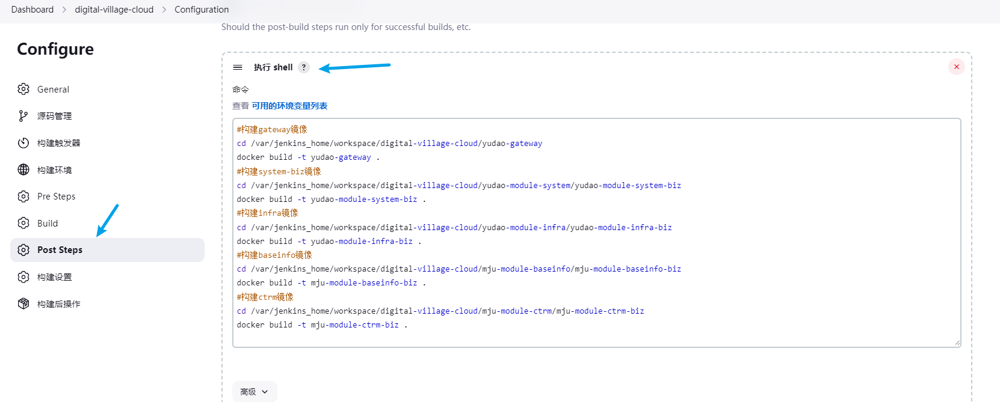

## 运行Docker镜像

在Jenkins安装插件[Publish Over SSH](https://plugins.jenkins.io/publish-over-ssh)

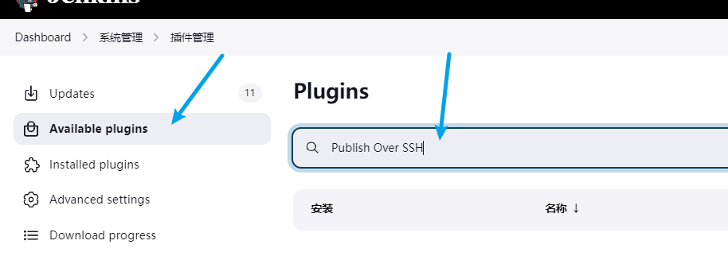

在系统管理中设置里 增加SSH Server

填写主机地址 以及登录用户名 和使用密码登录 填写密码

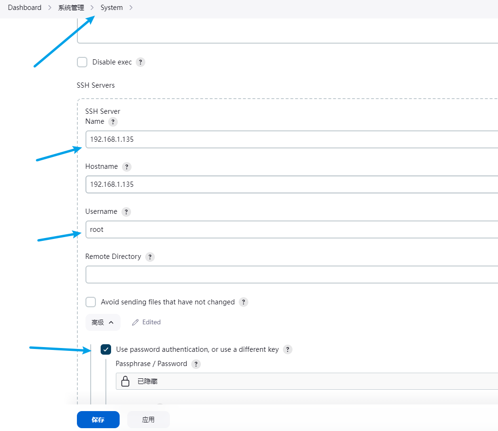

在构建完新增往新主机推送文件

选择一个需要远程的主机

需要传送的文件 必须填可以随便传送一个文件

传送到远程地址的位置 Remote directory

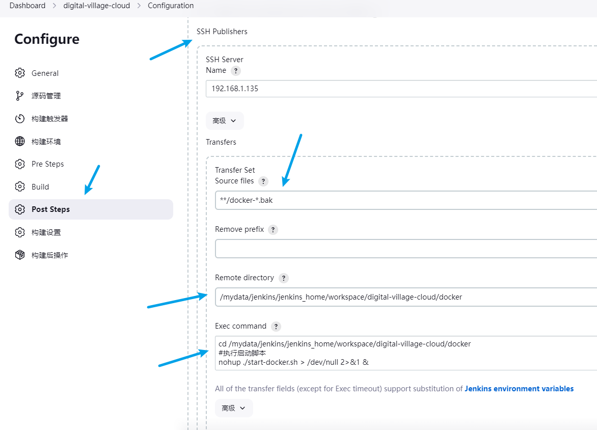

```shell
#执行docker compose脚本  compose 脚本需要自行编写

# 进入自己项目写好的docker配置文件
cd /mydata/jenkins/jenkins_home/workspace/digital-village-cloud/docker
# 执行启动编写好的启动脚本
nohup ./start-docker.sh > /dev/null 2>&1 &
```

start-docker.sh

```shell
#!/bin/bash  
  
# 清除镜像防止生成过多镜像文件
docker rmi $(docker images -f "dangling=true" -q)

docker compose -p back-stage up
```

